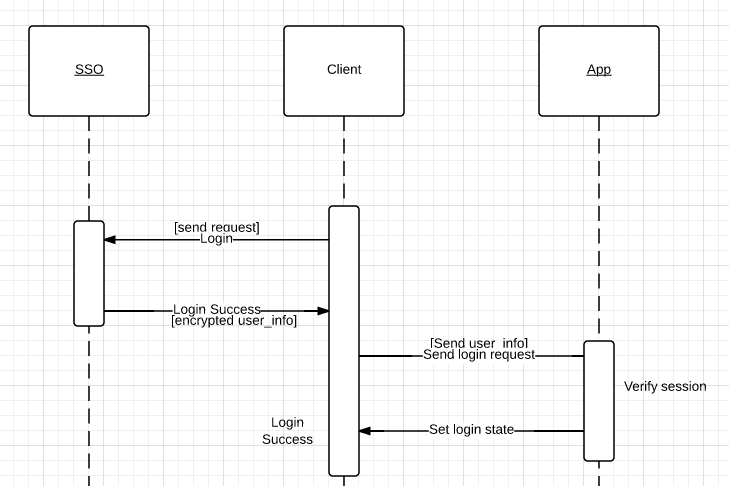

单点登录系统（SSO）使用教程
===========================

概念介绍
--------

SSO（Single
Sign-on）单一登录系统，用于实现不同软件系统中的用户信息同步。

本 SSO 系统通过 JSONP
实现跨域名登录支持，提供用户基础信息、登录历史的存储。 App
在存储这些数据时需要向 SSO 服务器发送请求以更新数据。 App
无需存储用户数据，用户数据存储在 SSO 上，App 只需要存储用户数据版本号。

流程介绍
--------

名词解释：

-  sso：提供 SSO 服务的服务器
-  app：使用 SSO 服务的应用（暂时仅支持网站）
-  client：客户端，通常是浏览器。

开发之前
--------

依赖
~~~~

1. 第三方库：\ ``jQuery1.11``\ ，\ ``json2.js``\ ，\ ``jquery.fancybox.js``\ ，\ ``avalon.js``
2. 本地 CSS：\ ``css/_lib/fancybox*``\ ，\ ``css/SSO/*``
3. 本地 JS/CoffeeScript
   依赖：\ ``js/_lib/cookie.js``\ ，\ ``async.coffee``\ ，\ ``jquery_ext.coffee``\ ，\ ``jquery.poshytip.js``\ ，\ ``uploader.coffee``
   (为个人设置提供的图片上传功能)

注册应用
~~~~~~~~

在 SSO 服务器上注册应用，并提供 App 名称、App 域名，SSO
域名（建议统一使用 ``sso.[App 域名]``\ ）、数据同步地址、登录地址。

使用 GET 方法注册应用：GET

::

    http://sso.tech2ipo.com/rpc/app.new?o=["app_name","app_host","app_sso_host","app_sync_url","app_sso_login_url"]

例如：为 b.com 注册应用的 URL 可以是这样的：

::

    http://sso.b.com/rpc/app.new?o=["SITE B","b.com","sso.b.com","http://b.com/rpc/sso.sync","http://b.com/rpc/sso.login"]

相应的，服务器会给返回一个 ``app_id`` 以及对应的
``app_token``\ ，作为你的身份认证标志。返回的结果类似这样：

::

    [9912662,"wuVsjhBuBXDwv3wpTo5itE1WwtvjFXaozBNsce52keJw5J5_sOpPe-I8Ge5YuqPK"]

DNS 设置
~~~~~~~~

将网站的 app\_sso\_host 的 CNAME 指向 ``sso.tech2ipo.com``\ ，可以使用
dig 命令查看 CNAME 是否设置成功。

简单的流程图
~~~~~~~~~~~~

   uml

身份验证
^^^^^^^^

因为存在 Client 端到 App
端的数据更新操作，所以需要相应的身份验证操作以保证安全。sso 在设计时采用
session 进行身份验证，

简单实现
--------

-  `Python 示例 <https://github.com/kxxoling/ac-sso-demo>`__

参数说明
--------

App 需要实现注册时提交的 ``app_sync_url`` 和 ``app_sso_login_url`` 的
GET 方法调用。

app\_sso\_login\_url
====================

``app_sso_login_url`` 的作用是接收 SSO
服务器的登录成功回调，并为用户设置登录状态。

``app_sso_login_url`` 接收的参数为
session、user\_info\_id、expires\_days，App 使用 app\_token decode
session 获取 sso\_user\_id，如果成功则说明用户已登录，App 需要再根据
sso\_user\_id 从自己的数据库中查询对应的
app\_user\_id，并为用户设置已登录的状态，对应 cookie 和 session
的过期时间应该设置为 expires\_days。

app\_sync\_url
====================

``app_sync_url`` 提供一个数据同步接口，由 Client 端向 App
端同步数据。数据的同步永远是单向的。

``app_sync_url`` 接收的参数为
sso\_id、user\_info\_id、mail、ico、name、sign、phone，其中仅有前两者为必需项，后四项如无则留空。

注意事项
--------

urlsafe base64 encode
~~~~~~~~~~~~~~~~~~~~~

由于 base64 encode 的字符在存放在 url 中时会被再次
encode，导致数据失真，因此需要注意下 encode/decode 的实现，例如 Python
中可以直接导入：

.. code:: python

    from base64 import urlsafe_b64encode, urlsafe_b64decode

PHP 示例：

.. code:: php

    function urlsafe_b64encode($input) {
      return strtr(base64_encode($input), '+/=', '-_,');
    }

    function urlsafe_b64decode($input) {
      return base64_decode(strtr($input, '-_,', '+/='));
    }

配置文件
^^^^^^^^

配置见示例代码： `Python
示例 <https://github.com/kxxoling/ac-sso-demo>`__

路线图
------

其他计划开发中的功能：

-  多账户系统（参照 DNSPOD 和 Google）
-  IM、私信及系统通知（参照雪球）
-  友邻推荐系统（整合到通知系统）
-  各种社交账号登录（参照多说）
-  头像剪裁
-  移动网页适配以及移动应用开发的 API（登录、聊天）
-  插件、扩展（eg：鼠标移动到姓名上悬浮出现个人资料；点击姓名弹出展示卡片）

